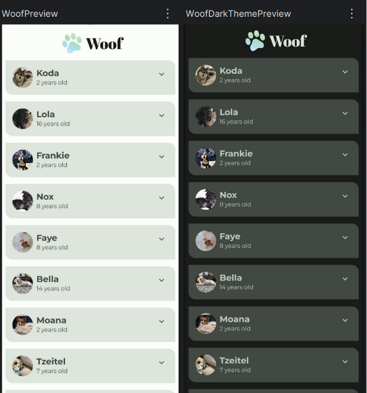
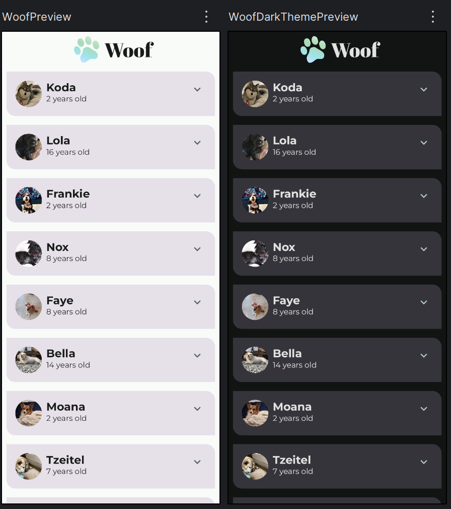

# 🎨 Material Theming with Jetpack Compose

  **Nama:** Nabilah Atika Rahma  
  **NRP:** 5025221005  
  **Kelas:** PPB G - Task 9

Build a consistent, attractive, and modern Android application using **Material Theming** with **Jetpack Compose**! This codelab demonstrates how to customize **colors, typography, and shapes** based on **Material Design 3**. You can also personalize the theme according to your preferences.

## 📱 About the Project

This codelab guides you in developing the **Woof** application — a dog listing app designed with elegant visuals using Material Design principles.

<p align="center">
  
  
</p>

---

## 🔧 Key Features

✅ Consistent light & dark color schemes  
✅ Professional-looking custom fonts  
✅ Dynamic and rounded UI shapes  
✅ Top App Bar with logo and app title  
✅ Responsive and modern with Compose

---

## 🧠 What You Will Learn

1. Apply **Material Theming** in Compose  
2. Customize **color palettes** using the Material Theme Builder  
3. Use **custom fonts** for text and titles  
4. Shape UI elements with **Rounded Corners**  
5. Create an appealing and informative **Top App Bar**  

---

## 🧰 Prerequisites

- Basic knowledge of **Kotlin**
- Experience with **Jetpack Compose**
- Familiarity with creating simple lists in Compose

---

## 🚀 How to Run

1. Clone the repository:
   ```bash
   git clone https://github.com/your-username/woof-material-theming.git
   ```
2. Open it in Android Studio (Arctic Fox or newer)  
3. Run the app on an emulator or Android device

---

## 🗂️ Folder Structure

```
📦 woof-material-theming
 ┣ 📁 ui
 ┃ ┣ 📄 Theme.kt        ← Theming configuration
 ┃ ┣ 📄 Color.kt        ← Light & dark color schemes
 ┃ ┣ 📄 Type.kt         ← Custom typography
 ┣ 📁 res
 ┃ ┣ 📁 font/           ← Montserrat & Abril Fatface fonts
 ┃ ┣ 📁 drawable/       ← App logo
 ┣ 📄 MainActivity.kt   ← App entry point
```

---

## 📝 Notes

- Color schemes generated with [Material Theme Builder](https://material-foundation.github.io/material-theme-builder/)
- Fonts sourced from [Google Fonts](https://fonts.google.com/)
- Compatible with Android 5.0 (API 21) and above

---

## 📚 References

- [📘 Material Design Guidelines](https://material.io/design)  
- [📘 Jetpack Compose Documentation](https://developer.android.com/jetpack/compose)  
- [📘 Official Codelab](https://developer.android.com/codelabs/basic-android-kotlin-compose-material-theming)

---